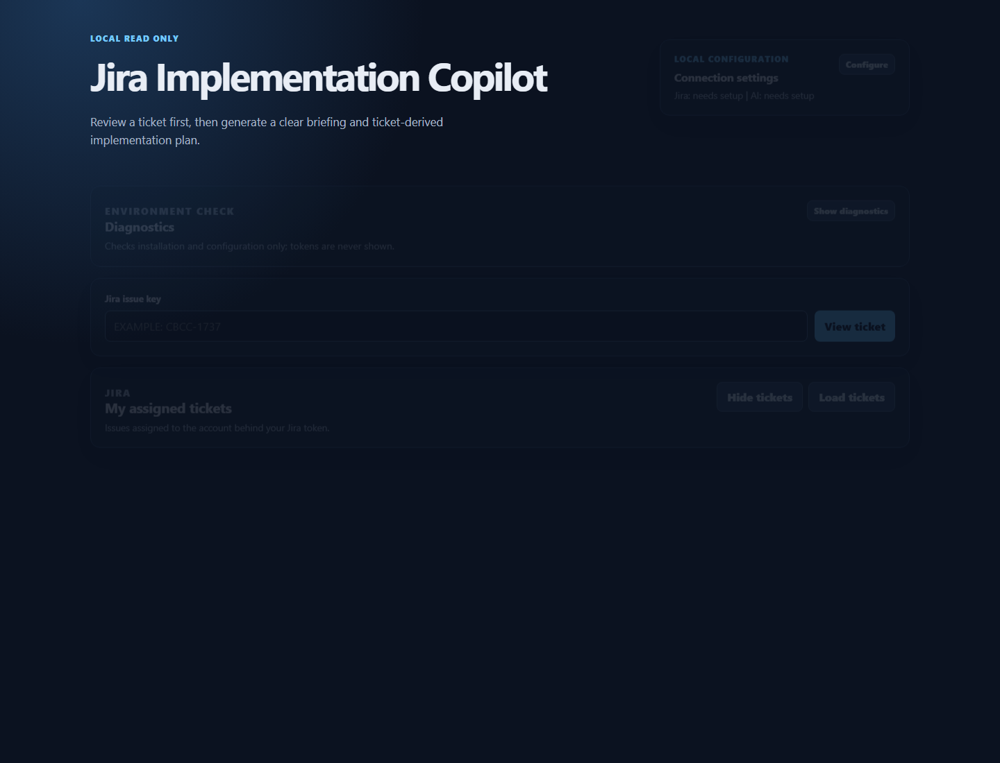

# Jira Implementation Copilot

A local developer tool that turns a Jira ticket into a clear briefing and a ticket-derived implementation plan. It is designed for individual developer machines and is **read-only for Jira**: it never creates, edits, comments on, transitions, or deletes issues.



## What it helps with

- Browse tickets assigned to the Jira account behind your personal access token.
- Filter by status, project, label, priority, and recently updated date; save useful views in your browser.
- Turn a ticket into an easy-to-read briefing and code plan shown as dark, animated card decks.
- Export an analysis as Markdown, save feedback locally, and use a checklist to work through the plan.
- Create a confirmed local Git implementation branch. This affects only the repository folder you choose; it never changes Jira or writes code automatically.

## Before you start

Each developer needs the following on their own computer:

1. Node.js 20 or later and npm.
2. Access to the required Jira projects plus a Jira Personal Access Token (PAT).
3. One AI option:
   - signed-in Gemini CLI;
   - signed-in Codex CLI;
   - signed-in Claude CLI; or
   - an OpenAI or Gemini API key, if company policy permits it.

### Request Jira API access

Before configuring the app, apply for the required Jira access through the Samsung SDS R&D 365 portal:

[Apply for Jira API access on R&D 365](https://rnd365.samsungsds.com/)

Request access to the Jira projects you need and permission to create/use a Personal Access Token. The token owner needs **Browse Projects** access, any applicable issue-security access, and permission to view comments when comments will be included as AI context. No Jira write permission is required by this application.

## Install and run

```powershell
git clone https://github.com/cj-adonis/jira-implementation-copilot.git
cd jira-implementation-copilot
npm install
npm run doctor
npm run dev
```

Open the local URL shown by Vite, normally [http://localhost:5173](http://localhost:5173).

On Windows, you can instead double-click `start-jira-copilot.cmd` or the Desktop shortcut created by the launcher. The shortcut starts the local server and opens the browser.

## First-run setup

1. Open **Configure** in the top-right corner.
2. Enter your Jira base URL, such as `https://jira.company.example`.
3. Paste your Jira PAT. It is saved only to your local `.env` file and is never displayed again.
4. Select an AI provider.
   - For Gemini, Codex, or Claude CLI, sign in to that CLI in a terminal before starting this app.
   - For API-key providers, enter the key and select a model.
5. Click **Save setup**.
6. Use **Show diagnostics** to verify Node, Jira configuration, and the selected provider. The diagnostics panel is collapsed by default to keep the page focused.

Do not commit `.env`, PATs, or API keys. `.env` is already ignored by Git.

## How to use the app

### 1. Find a ticket

- Enter a Jira key, such as `CBCC-1737`, then select **View ticket**; or
- Select **Load tickets** under **My assigned tickets**.

Use the status, project key, label, priority, and update-date filters to narrow the list. Choose **Save view** to store a useful filter combination in this browser. Choose **Hide tickets** whenever you need more space.

### 2. Review the ticket before using AI

The ticket details page shows the summary, status, priority, description, linked issues, and an **Open in Jira** link. Select the context you want to include:

- Description
- Recent comments
- Linked issues

Use **Preview prompt** if you want to inspect the generated AI context first. If a ticket appears to contain a password, token, secret, or API-key assignment, the app asks for confirmation before sending selected context to the configured AI provider.

### 3. Generate and read the analysis

Select **Generate briefing and plan**. The result is split into two dark card decks:

- **Issue Briefing** explains the goal, plain-language developer focus, requirements, questions, and acceptance criteria.
- **Ticket-to-Code Plan** lists suggested implementation steps, generic code areas to inspect, tests, dependencies, assumptions, and risks.

Use **Previous** and **Next** to review one topic at a time. Dots and the progress bar show where you are in each deck. Copy an individual card, copy all results as Markdown, or download a `.md` file.

The review banner calls out unresolved questions and assumptions. Treat those as items to confirm, not as established ticket facts.

### 4. Start implementation safely

In **Start implementation**, enter the path to an existing local Git repository and confirm the action. The app verifies the folder is a Git repository, creates a branch named like `feature/cbcc-1737-implementation`, and switches to it.

The plan checklist is stored only in your browser. This feature does not scan your repository, generate code, push branches, or modify Jira.

## Screenshots

### Dashboard and ticket workspace


## Useful commands

```powershell
npm run dev      # Start API and web development servers
npm run doctor   # Check Node, dependencies, local config, and terminal CLI availability
npm run build    # Create a production build
npm test         # Run unit tests
```

## Troubleshooting

| Problem | What to do |
| --- | --- |
| Jira authentication or permission error | Confirm your Jira base URL, PAT, project access, and request access through [R&D 365](https://rnd365.samsungsds.com/). |
| Gemini, Codex, or Claude CLI cannot run | Run the provider CLI directly in a terminal and sign in. Restart this app with `npm run dev`, then use **Show diagnostics**. |
| AI provider returned an invalid structured analysis | Generate again with fewer selected context sections, beginning with comments unchecked. The app requires a strict JSON response and safely handles common code-fence wrappers. |
| Port already in use | Close older Jira Copilot terminal windows, then run `npm run dev` again. |
| Branch already exists | Switch to the existing `feature/<issue-key>-implementation` branch manually, or choose a different repository. |

## Security and privacy

- Jira PATs and AI API keys stay on the local server in `.env`; they are not sent to the browser, saved in browser storage, shown in output, or committed to Git.
- Terminal AI providers use the signed-in session available on the developer’s computer.
- Selected Jira ticket context is sent to the chosen AI provider only after the developer chooses **Generate briefing and plan**.
- Jira calls are limited to `GET /rest/api/2/issue/{issueKey}` and `GET /rest/api/2/search` for assigned-ticket retrieval.
- The project performs no Jira writes.

## Repository development

```powershell
npm install
npm run doctor
npm test
npm run build
```

Contributions should preserve the local-first secret handling and the read-only Jira boundary.
